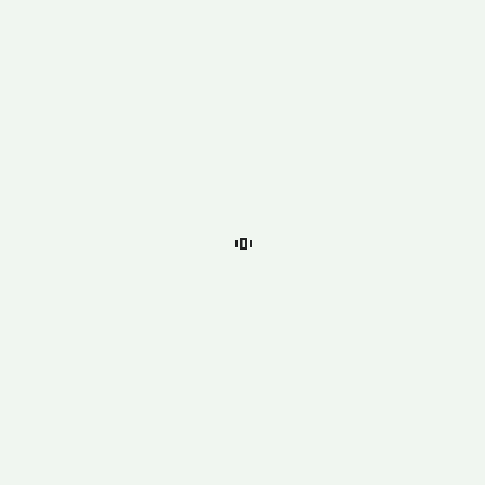
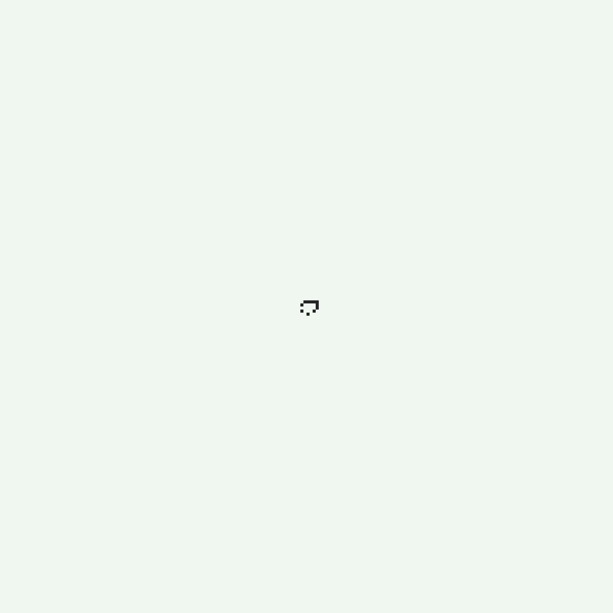
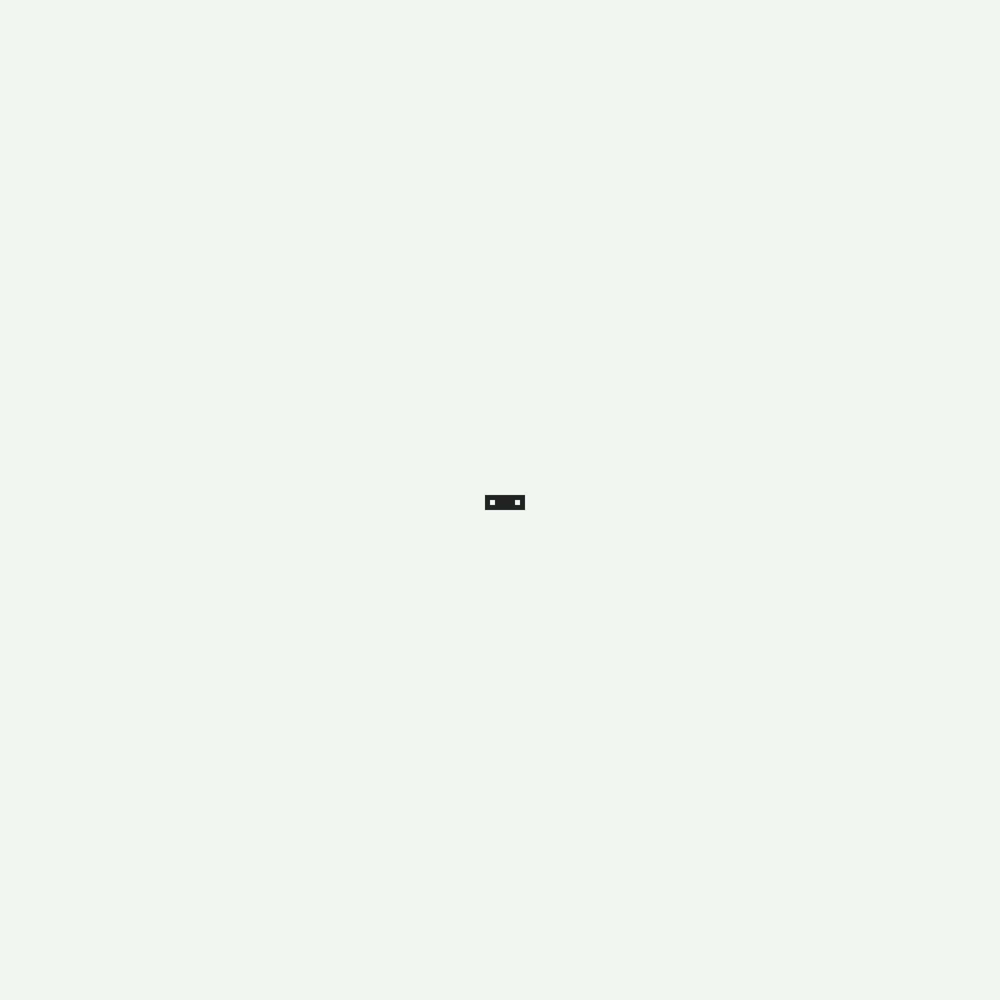

# Conway

[](https://opensource.org/licenses/MIT)

### Matteo Golin

A Pythonic recreation of Conway's game of life using classic and alternative rules for cell implementation. Games are
exported as GIFS.

## Requirements
- Python 3.9.2 greater
- Pillow module
- Progress module

## Usage

### Config File

Parameters of the simulation can be changed using the `config.json` file. The config allows the user to change:

- Epochs: How many generations the simulation should play for
- Dimensions: The size of the simulation area
- Animation:
    - Colours: The colours of alive and dead cells
    - Frame duration: How long each frame of the exported GIF will run for, in ms
    - Scale: The scale multiplier of the simulation GIF
        - If your simulation is `100x100` and your scale is `4`, the GIF will be `400x400`. Larger scales take more time
          to process

### Code

First, configuration parameters must be loaded using the `Config()` class. This config will be used to pass simulation
parameters specified in `config.json` to other parts of the code.

Second, a seed must be created. All simulations require a seed to begin the cell growth. A library of seeds is included
to make this easy. See the [Seeds section](#seeds). If the simulation needs to be reproduced later, the seed must be
exported using the `export_seed(<seed>)` utility function. This will save the seed to `previous_seed.json`. Previous
seeds can be loaded using the `previous_seed()` utility function.

Third, a `Grid` object must be created to host the simulation. The Grid requires dimensions, a number of epochs to run
for, a seed and the [type of cell](#cells) that the simulation should use.
If the user desires to run the simulation without a specified number of epochs, the `continuous` keyword parameter
should be set to `True`. This will run the simulation until all cells are detected to have `died` (hold a static
position/oscillate in a stable way).

**Exporters**

All exporters implement an `export` method. The `export` method takes a file path and colour palette (tuple of two hex
codes) as parameters. If no colours are provided the exporter will use the
[1bit Monitor Glow palette](https://lospec.com/palette-list/1bit-monitor-glow) by default.

To export a GIF of the simulation, the `Grid` object should be passed to a `GIFExporter` object, along with the
configuration settings for scale and the frame duration.

Alternatively, the simulation can be exported using the `ImageExporter` class. The `ImageExporter` class requires the
`Grid`, animation scale and step size as arguments. The step size controls after how many epochs a generation snapshot
should be saved as an image. Image filenames will be given a numerical suffix.

The file extension of the image can be set via the `extension` setter on the `ImageExporter` class. By default, images
are exported as PNGs.

**Additional Functions**

The utility function `map_center()` can be used to quickly find the center of the `Grid` using the config dimensions.
This streamlines placing seeds in the center of the map.

The utility function `percentage_of_map()` can be used to calculate how many cells are the given percentage of the map,
given the dimensions. This makes `ChaosSeed` implementations easier because the programmer does not need to eyeball how
many cells they need for their seed.

### Example usage

```Python
    # Start parameters
config = Config()

seed = ChaosSeed(
    cell_number=percentage_of_map(10, config.dimensions),
    deviation=4
).translate(map_center(config.dimensions))
export_seed(seed)  # Export seed

# Create game
print("Starting grid generation...")
grid = Grid(
    cell_type=ClassicCell,
    dimensions=config.dimensions,
    seed=seed,
    epochs=config.epochs,
)
print("Grid generation complete.\n")

# Create exporter
gif_exporter = GIFExporter(
    grid=grid,
    scale=config.animation.scale,
    frame_duration=config.animation.frame_duration,
)

# Export the simulation as a GIF animation in the current directory
print("Running simulation...")
gif_exporter.export(filepath="./animation", colours=config.animation.colours)
```

## Cells

### Classic Cell


### Maze Cell


### Frost Cell


## Seeds

### Pulsar Seed

Part of the oscillators group.


### Middle Spaceship Seed

Part of the spaceship group, where a collection of cells moves in unison across the grid.


### Shoebox Seed

A seed that quickly becomes chaotic from very few initial cells.


### Pentadecathlon Seed

Part of the oscillators group as well, with a long cycle.

